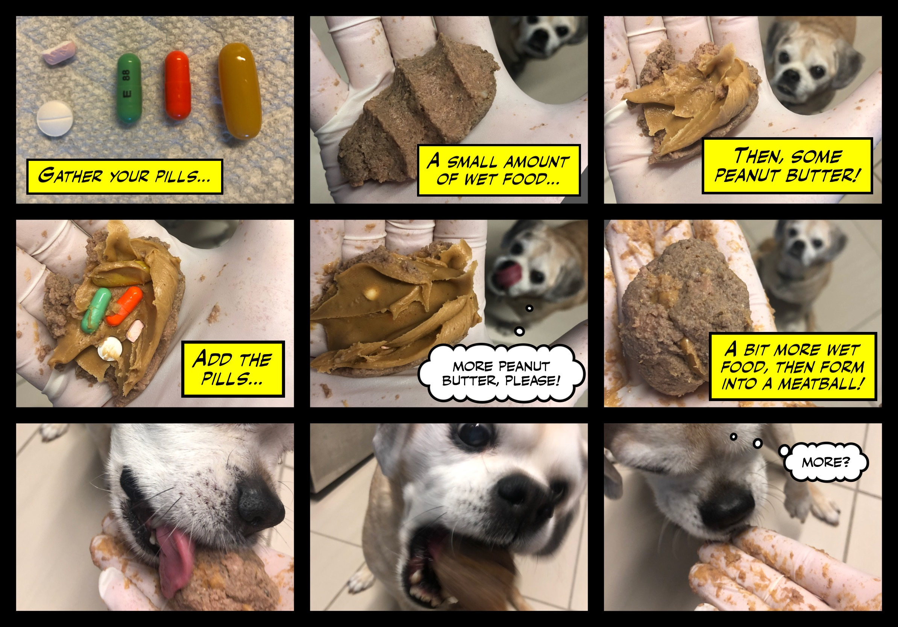

Welcome to Jersey City! Located conveniently across the Hudson River from Manhattan, our neighborhood offers many amenities not afforded us in our former West Village apartment, such as:

- An outdoor pool and fire pit!
- A functional shower drain!
- A 24-hour fitness center!
- Control over the temperature of our apartment!
- In-unit washer and dryer!
- Peace and quiet!
- Virtual golf, for some reason?

While our new 'hood may lack some of the "character" of the Village, all of life's necessities are still close-at-hand: [Hudson Greene Market](http://www.hudsongreenemarket.com/) offers healthy groceries; [Liberty Wine and Deli](https://www.yelp.com/biz/liberty-wine-and-deli-jersey-city) offers healthy bourbons and other spirits; and [Downtown Pharmacy](https://www.downtownpharmacyjc.com/) offers a pharmacy that is downtown. (There's also now a [CVS](https://www.cvs.com/) across the street, if you're into that whole corporate chain thing.)

The excitement of The Big Apple is but a single stop away on the PATH. From the World Trade Center Transit Hub (aka "The Oculus") you can catch the ①, ⒶⒸⒺ, ⓇⓌ, ⒿⓏ, and ④⑤.

The PATH to WTC will be closed on non-holiday weekends for the next two fucking years for Hurricane Sandy repairs, but you can present a SmartLink card at the [Harborside Ferry Landing](https://www.nywaterway.com/HarborsideFerryLanding.aspx) for a free ferry ride to [Brookfield Place](https://www.nywaterway.com/WorldFinancialCenterTerminal.aspx). It's always best to check the [PATH website](https://www.panynj.gov/path/) before heading into the city over the weekend.

## Gaining access to the apartment

Most likely we have put you on the "authorized users" list. When you arrive, you must surrender your ID and sign your name to get the temporary spare key. Please use this to enter the apartment, and then return it right away.

A different set of keys and a PATH SmartLink card will be waiting for you on the counter.

## Meet your robot roommate

If you need help with anything, just ask, "Alexa, open the apartment guide." She knows where everything is and is located next to the coffee maker. You can ask her things like:

- Where is the dog leash?
- What's the wifi password?
- How do I turn on the television?
- What's the phone number for the vet?
- When will this dystopian nightmare finally end?

If you need to know where anything is, Alexa will hook you up.

## Meet your four-legged roommate

As you may already be aware, Beta is on a regimen of immunosuppressive drugs following a relapse of [IMHA](http://scvsec.com/wp-content/uploads/2014/04/Immune-Mediated-Hemolytic-Anemia-Canine.pdf) (Immune Mediated Hemolytic Anemia).

Her initial high-dose course of prednisone made her hella thirsty. High water input leads to high... output. Recognizing the impracticality of taking her on 172 walks a day, we gave in and trained her to go on wee wee pads.

And while her prednisone dosage—and subsequent ravenous thirst—has since tapered considerably, she has grown accustomed to the convenience and immediacy of peeing and pooping indoors whenever she pleases. Old dog, new tricks, something something something. It's easier to just let her do her thing. (She still gets her morning and evening walks.)

The pads are strictly single-use, so once soiled, promptly discard and replace, or she'll relieve herself *near* the pad when nature next calls. We've found it helpful to leave two pads out before going to bed, just in case. 

Extra pads are in the white Kallax unit next to the kitchen counter, in the blue bottom-left bin.

Medication is given twice a day. Hiding her pills in a dogfood meatball is the easiest way for the medicine to go down. Here's the technique we use:

1. Wear latex gloves! She's on some heavy-duty shit that has to be handled carefully.
2. Gather her pills onto a small square of paper towel, into a pharmaceutical mise en place of sorts. 
3. Grab a small scoop of wet dog food with one hand.
4. With the other hand, spread a smear of peanut butter onto the top of the dog food with a butter knife.
5. Press each pill into the smear of peanut butter.
6. Spread another smear of peanut butter on top, sealing the pills in place.
7. Top the meatball off with another scoop of wet dogfood, and form into a sphere.

At some point in this process, Beta will have realized what's going down, and should now be underfoot. Bend down and present the meatball to her. She will give it a sniff and house it directly out of your hand.

In the morning, she gets:

- 125mg mycophenolate (1 orange pill)
- 50mg cyclosporine (1 yellow pill)
- 10mg fluoxetine (1 pill)
- 3mg melatonin (1 pill)
- Half a pepcid (they should be pre-cut for you already)

(Starting in July, she is no longer on prednisone! Thank God.)

After she has her meatball, she gets some breakfast: more wet food (about half a can in total), with 1/8th teaspoon each of Tylan and Entoroflora powders (located in the refrigerator) mixed in to aid digestion, and 10 drops of Rescue Remedy (in the blue dropper, also in the fridge) to chill her the fuck out. There is a 1/8th teaspoon in the fridge as well. Top with a 1-cup scoop of dry food.

Her evening pill regimen is simpler:

- 50mg cyclosporine (1 pill)
- 125mg mycophenolate (1 pill)
- 3mg melatonin (1 pill)
- Half a pepcid
- 10 drops of rescue remedy on a bit of wet food

You can reach Beta's vet, Dr. John Gagliardi, at (212) 777-2630. 

In an emergency, call Blue Pearl Animal Hospital at (212) 924-3113.

Beta's crate is equipped with a [Tactical Canine Surveillance System](https://dansays.cloud/betacam/), should you wish to monitor her sleep patterns remotely.

## Meet your delivery persons

Our good friends, Dan & Katie (no relation), have helpfully provided local food options, should you not wish to travel into the city:

- Mexican: [Taqueria Downtown](http://www.taqueriadowntowncateringco.com) or [Tacos Victoria](http://tacosvictoria.com)
- Indian: [Amiya](http://www.amiyarestaurant.com)
- Turkish: [Rumi](http://rumiturkishgrill.com) (right across the street)
- American: [Amelia’s Bistro](http://www.ameliasbistro.com)
- Ramen: [Kitakata](http://ramenbannai.com)
- Chinese: [Taste of North China](http://www.tasteofnorthchinajc.com)
- Poke: [Tidal Poke](http://tidalpoke.co)
- Specialty: [Wurstbar](https://www.wurstbarjc.com) (gourmet brats and dogs)

We're also fond of [Matthews](https://www.mathewsfoodanddrink.com), and have enjoyed many a fine cocktail at both [Dullboy](https://www.dullboybar.com) and [The Archer](http://www.archerbar.com). And if you like pizza, [Razza](https://razzanj.com) is groin-grabbingly transcendent. (Expect a wait.)
	
## Apartment and building amenities

Feel free to do laundry while you're here. Washer and dryer are located in the 2nd closet next to the door. Just note that the "time remaining" listed on the washer is sometimes a lie.

The clock above the kitchen counter is definitely a lie; this clock is broken.

The thermostat is located in the bedroom.

Extra toilet paper is under the sink. Extra paper towels are in the kitchen pantry. 

The trash chute/recycling is located next to the elevators. Additional liners are on a white roll under the sink. 

Siri controls the TV and video game systems; however, it is better to use the switches to turn off and on the lights.

Most of the building amenities are located on the 11th floor: the gym, the hot tub and pool, the fire pit, and the dog run. If you plan on going for a swim, please wear a blue wristband, located on the coat hanger next to the front door. (And please don't lose it! They're $200 to replace!)

The pool and firepit are open at 10am and until 10pm Sundays through Thursdays, and 11pm on Fridays and Saturdays. No glass is allowed on the deck. 
